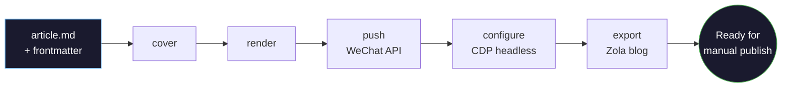
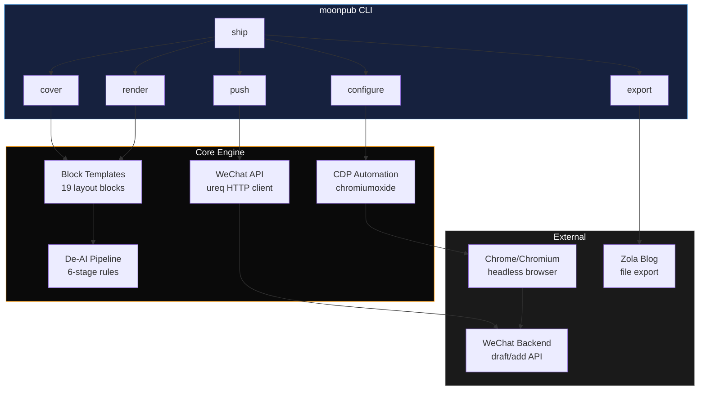

# MoonPub

[](#contributors-)


Pure Rust CLI and local publishing copilot for WeChat Official Accounts: Markdown → rendered article → WeChat draft → assisted backend configuration → blog export.

## Project Status

MoonPub is currently **Beta / early adopter ready**.

It is ready for technical users who can configure WeChat Official Account credentials and are comfortable checking generated drafts before publishing. The local Markdown → HTML preview path works without any WeChat credentials, so you can try the renderer first. Real `push` / `ship` commands call the WeChat API and may open or control Chrome for backend draft configuration.

MoonPub is **not** positioned as an unattended publishing bot. The stable core is API-first draft creation and local rendering; browser automation is an assisted mode that reduces repeated clicks in the WeChat backend while keeping final publishing under user control.

## Pick Your Entry Path

If you do not want to read the full command surface first, choose the path that matches how you work:

### 1. You already have a Markdown article

Use:

- `existing Markdown article -> local preview -> WeChat draft`

This is the best fit if your article is already written in Obsidian or Markdown and you mainly need rendering plus publishing.

### 2. You only have Feishu Minutes or raw transcript material

Use:

- `Feishu Minutes transcript -> editable draft -> preview -> WeChat draft`

This is the best fit if your content starts as raw spoken notes and should become a draft before publishing.

### 3. You mainly work inside Obsidian and want less terminal usage

Use:

- `Obsidian plugin homepage -> context-aware entry -> preview / assisted publish`

This is the best fit if you want to start from the MoonPub homepage inside Obsidian, see workspace-level guidance first, and then continue into the right workflow for the current article, Feishu material, or photos.

### 4. You mainly want to turn a batch of photos into a draft

Use:

- `photos -> editable draft -> preview -> WeChat draft`

This is the best fit if your content starts as a small set of real-life photos that you want to preserve as a factual note before deciding whether to publish.

See:

- [docs/RECOMMENDED_WORKFLOWS_ZH.md](docs/RECOMMENDED_WORKFLOWS_ZH.md)
- [docs/FIRST_RUN_WALKTHROUGH_ZH.md](docs/FIRST_RUN_WALKTHROUGH_ZH.md)
- [docs/FIRST_RUN_AUDIT_ZH.md](docs/FIRST_RUN_AUDIT_ZH.md)
- [docs/PRODUCT_WRAP_ZH.md](docs/PRODUCT_WRAP_ZH.md)
- [obsidian-plugin/README.md](obsidian-plugin/README.md)

Current limits:

- Browser automation depends on the live WeChat backend UI and may soft-fail when WeChat changes DOM or wording.
- Browser automation does not bypass QR login, captcha, platform review, or final human confirmation.
- Homebrew support is planned, but no public tap is available yet.
- `write` / `expand` / `polish` / `ship --ai` are optional AI-powered commands (configurable provider: DeepSeek, OpenAI); the core render/push pipeline does not call AI APIs.

## What It Does

Write an article in Markdown, render it locally, push it to WeChat drafts, then let MoonPub assist with repetitive backend settings:

```bash
moonpub render article.md
moonpub preview article.md
moonpub ship article.md --style literary
```

### v0.4.1 Demo Output

The screenshots below were generated from the v0.4.1 release binary without WeChat credentials.


### Pipeline Flowchart



### Architecture



Core rendering is local and deterministic. Optional AI commands call an AI provider only when you explicitly use them.

## Try Locally First

If you want a narrower "which path should I use first?" answer instead of reading the full command surface, see [docs/RECOMMENDED_WORKFLOWS_ZH.md](docs/RECOMMENDED_WORKFLOWS_ZH.md). If you want the shortest first-run walkthrough centered on the plugin homepage plus Feishu / photos / current-article entry paths, see [docs/FIRST_RUN_WALKTHROUGH_ZH.md](docs/FIRST_RUN_WALKTHROUGH_ZH.md). If you want the evidence-based first-run audit of which paths are already strong and which still need stronger proof, see [docs/FIRST_RUN_AUDIT_ZH.md](docs/FIRST_RUN_AUDIT_ZH.md). If you want the concrete screenshot/recording checklist plus the in-repo archive layout for homepage / Feishu / photos evidence, see [docs/FIRST_RUN_EVIDENCE_CHECKLIST_ZH.md](docs/FIRST_RUN_EVIDENCE_CHECKLIST_ZH.md) and [docs/first-run-evidence/README.md](docs/first-run-evidence/README.md). If you want to know what still gates the next release, see [docs/RELEASE_GATE_v0.4.2_ZH.md](docs/RELEASE_GATE_v0.4.2_ZH.md). If you want the higher-level product framing of what MoonPub currently is, what it is not, and how Core / Input Workflows / User Surfaces fit together, see [docs/PRODUCT_WRAP_ZH.md](docs/PRODUCT_WRAP_ZH.md). The recommended workflows doc currently captures the main entry paths we want users to follow first:

- existing Markdown article -> local preview -> WeChat draft
- Feishu Minutes transcript -> editable draft -> preview -> WeChat draft
- photos -> editable draft -> preview -> WeChat draft

If you mainly work inside Obsidian, the plugin entry is no longer just a few commands. The homepage now runs `moonpub doctor --json` for local readiness, `moonpub workflow-registry --json` for supported workflow contracts, and `moonpub workspace --json` for workspace-level status and suggested next steps, then lets you continue into current-article, Feishu, or photo flows from one place. See [obsidian-plugin/README.md](obsidian-plugin/README.md).

Agents, plugins, and app shells can call `moonpub workflow-registry --json` to discover the built-in workflow contracts for current articles, Feishu Minutes, photo memories, and WeChat draft handoff without scraping README text.

This path does not require WeChat credentials:

```bash
moonpub init
moonpub new "My First MoonPub Article"
moonpub render "Articles/drafts/My-First-MoonPub-Article.md"
moonpub preview "Articles/drafts/My-First-MoonPub-Article.md"
moonpub cover "Articles/drafts/My-First-MoonPub-Article.md" --style literary
```

Use the path printed by `moonpub new` if your title contains spaces. Start here to inspect the generated article HTML and cover card.

## Real Publish Workflow

### 1. Write

Markdown file with YAML frontmatter:

```markdown
---
title: Why I Left Everything to Paint
digest: He was 40, had a wife, kids, a good job. Then he walked away.
author: Your Name
cover: https://example.com/my-cover.png
---

:::intro
A 1-3 sentence hook to grab the reader.
:::

Your article content here...

:::summary
Closing thoughts.
:::
```

### 2. Preview

```bash
moonpub render article.md    # Generate HTML
moonpub preview article.md   # Open in browser to check
```

### 3. Configure WeChat Credentials

```bash
export WECHAT_APPID=wx***
export WECHAT_SECRET=your_secret
moonpub login
```

`moonpub login` opens Chrome once for WeChat backend login and stores the browser session for later CDP automation.

If you want an isolated one-off browser environment instead of MoonPub's default persistent profile, add `--temporary-profile`. This uses a temporary Chrome profile, does not read or write the saved session, and usually requires scanning the QR code again. `push` / `publish --target wechat-draft` also accept this flag; in that case the WeChat API draft upload stays the same, while the post-push backend automation uses the isolated profile.

### 4. Push Or Assisted Ship

```bash
moonpub ship article.md --style literary
```

The article is pushed to WeChat drafts, then MoonPub attempts draft configuration through Chrome automation. Check the draft in WeChat and publish manually when everything looks right.

When `push` creates a new WeChat draft for an article bundle that already has a local `.media_id`, MoonPub updates the `.media_id` file and then tries to delete the previous WeChat draft. Cleanup is best-effort and keyed by the recorded `media_id`, not by title, so same-title drafts are not removed accidentally.

### 5. Or Step by Step

Each step runs independently:

```bash
moonpub cover article.md --style gradient --screenshot   # Just cover image
moonpub render article.md                                 # Just HTML render
moonpub push article.md                                   # Upload draft, then move bundle to ready/
moonpub doctor --json                                     # Local first-run readiness, no WeChat API or browser
moonpub workflow-registry --json                          # Built-in workflow contracts for plugins / agents
moonpub capabilities --json                               # Machine-readable publish/export capabilities
moonpub layout-recipes                                    # Article layout recipe index
moonpub layout-audit article.html                         # Check rendered WeChat HTML compatibility risks
moonpub publish article.md --target wechat-draft          # Generic publish target entrypoint
moonpub configure                                         # Just draft config
moonpub export article.md --target zola                   # Generic export target entrypoint
```

### Feishu Publishing Flow

For Feishu content that already enters the draft-generation path, there are two recommended follow-up modes:

- Default conservative path: `moonpub intake feishu ... --draft --preview`
- Explicit fast-forward path: `moonpub intake feishu ... --draft --push`

The recommended default is to stop at an editable draft plus local HTML review first. Only add `--push` when you intentionally want to continue into WeChat draft creation right away.

There are also two different preview stages:

- Local preview: `moonpub preview <article.md>` or `intake feishu ... --draft --preview`
- WeChat backend preview-send: the preview step inside `configure` / `ship` after the article is already in WeChat drafts

Once a Feishu-derived article reaches WeChat drafts, the rest of the flow is the same as any other article: `configure` / `ship` -> WeChat backend preview-send -> manual publish.

`capabilities --json` includes top-level `schema_version` / `moonpub_version` fields plus each target's risk metadata, prerequisites, and argv-style `command` template. Plugin and app callers should check the schema, show missing `required_env` / `required_config` values, replace the `"{article}"` placeholder, and pass the array directly to the process runner instead of building a shell string.

For agent or app integration, these workflow/discovery commands return command-specific JSON objects under the global `--json` flag instead of the legacy `{"output":"..."}` wrapper:

- `moonpub doctor --json` → `command`, `moonpub_version`, `articles_root`, `config_status`, `capabilities_summary[]`, `warnings[]`, `next_step`, `next_command`
- `moonpub workspace --json` → `command`, `workspace_kind`, `entry_path`, `entry_path_label`, `total_articles`, `stage_counts`, `stages[]`, `capabilities[]`, `next_command`, `next_step`
- `moonpub workflow-registry --json` → `command`, `source`, `workflows[]`; each workflow includes `id`, `package`, `status`, `owner`, `safe_start_command`, `next_command`, risk flags, boundary text, evidence status, and docs
- `moonpub layout-recipes --json` → `command`, `guide`, `recipes[]`; each recipe includes `id`, `title`, `best_for`, `themes[]`, `blocks[]`
- `moonpub layout-audit <html> --json` → `command`, `html_path`, `passed`, `errors[]`, `warnings[]`, `next_step`
- `moonpub wechat-health --json` → `command`, `status`, `profile_mode`, `session_file`, `session_file_exists`, sanitized `current_url`, `next_command`, `next_step`
- `moonpub status --json` → `command`, `stages[]`, `next_command`, `next_step`; for each stage: `stage`, `count`, `files[]`; each file entry includes `file`, `slug`, `latest_status`, `latest_detail`
- `moonpub check <article.md> --json` → `command`, `article_path`, `html_path`, `draft_json_path`, `media_id_path`, `has_markdown`, `has_html`, `has_draft_json`, `has_media_id`, `publishable`, `next_command`, `next_step`
- `moonpub preview <article.md> --json` → `command`, `article_path`, `html_path`, `opened_browser`, `next_command`
- `moonpub push <article.md> --json` → `command`, `article_path`, `media_id`, `stage`, `next_step`
- `moonpub draft-from-inbox <inbox.md> --json` → `command`, `input_path`, `draft_path`, optional `html_path`, `action`, `next_command`; with `--push`, also `pushed`, `media_id`, `stage`, `next_step`
- `moonpub intake feishu ... --draft --json` → `command`, `inbox_path`, `draft_path`, optional `html_path`, `action`, `next_command`; with `--push`, also `pushed`, `media_id`, `stage`, `next_step`
- `moonpub intake photos ... --draft --json` → `command: "intake-photos"`, `inbox_path`, `draft_path`, optional `html_path`, `action`, `next_command`; with `--push`, also `pushed`, `media_id`, `stage`, `next_step`

Other commands still use the fallback single-field wrapper.

## Cover Image

MoonPub handles covers in three ways, in priority order:

### 1. Frontmatter `cover` field (easiest)

Put a local image path in your article's frontmatter:

```markdown
---
title: Why I Left Everything to Paint
digest: He was 40. He walked away.
cover: ./assets/my-cover.png     # relative to article, or absolute path
---
```

During `push` or `ship`, the image is **automatically uploaded** to WeChat permanent material and set as the draft cover. URLs (`http://...`) are downloaded first, then uploaded to WeChat.

### 2. Built-in cover generator (default)

If no `cover` field is set, MoonPub generates a cover card from frontmatter fields — title, digest, and author are typeset into a styled HTML card:

```bash
moonpub cover article.md --style dark|clean|minimal|warm|serif|gradient|literary|ink|sunset|forest --screenshot
```

Cover title fallback is shared by `cover` and `ship`: frontmatter `title` → first `#` heading → first meaningful body line → normalized file name. When title is still empty, the digest is promoted to the primary title line instead of rendering a placeholder like `无标题`.

Default style is **literary** — a dark, book-review aesthetic with gold accents. Export to PNG with `--screenshot` (requires Chrome).

### 3. Config `thumb_media_id`

Pre-upload an image to WeChat material library manually, put the resulting `media_id` in `moonpub.toml`:

```toml
[wechat]
thumb_media_id = "EmukC2rjB9X3nj6feGSEr..."     # from WeChat material library
```

**Priority:** frontmatter `cover` > config `thumb_media_id` > auto-generated cover. Once `cover` is set on an article, `ship` keeps using that image and does not replace it with a newly generated cover.

## Installation

### Option 1: Pre-built Binary (recommended, no Rust)

Download from [GitHub Releases](https://github.com/qiaopengjun5162/moonpub/releases). The latest public release currently verified is `v0.4.1`; the repository source version may be newer:

```bash
# macOS Apple Silicon
curl -L https://github.com/qiaopengjun5162/moonpub/releases/download/v0.4.1/moonpub-macos-arm64.tar.gz | tar xz
sudo mv moonpub /usr/local/bin/

# macOS x86_64
curl -L https://github.com/qiaopengjun5162/moonpub/releases/download/v0.4.1/moonpub-macos-amd64.tar.gz | tar xz
sudo mv moonpub /usr/local/bin/

# Linux x86_64
curl -L https://github.com/qiaopengjun5162/moonpub/releases/download/v0.4.1/moonpub-linux-amd64.tar.gz | tar xz
sudo mv moonpub /usr/local/bin/

# Linux ARM64
curl -L https://github.com/qiaopengjun5162/moonpub/releases/download/v0.4.1/moonpub-linux-arm64.tar.gz | tar xz
sudo mv moonpub /usr/local/bin/
```

**Windows** — 从 [Releases](https://github.com/qiaopengjun5162/moonpub/releases) 下载 `moonpub-windows-amd64.zip`，解压 `moonpub.exe`，加到 PATH。 Pull request CI already passes a no-credential smoke test for a source-built Windows binary, and the release workflow now smoke-tests the packaged zip before publishing. Use [docs/WINDOWS_SMOKE_CHECKLIST_ZH.md](docs/WINDOWS_SMOKE_CHECKLIST_ZH.md) when you want an extra manual verification on your own Windows machine.

### Option 2: Cargo (requires Rust)

```bash
cargo install --git https://github.com/qiaopengjun5162/moonpub
```

### Option 3: Docker (no Rust, includes Chromium)

```bash
docker build -t moonpub https://github.com/qiaopengjun5162/moonpub.git
docker run -v ~/.config/moonpub:/root/.config/moonpub -v $(pwd):/articles moonpub status

# Convenience alias
alias moonpub='docker run -v ~/.config/moonpub:/root/.config/moonpub -v $(pwd):/articles moonpub'
```

Homebrew support is planned, but no public tap is available yet. For the first public launch narrative and current progress bar, see [docs/LAUNCH_READY_ZH.md](docs/LAUNCH_READY_ZH.md), [docs/LAUNCH_PLAN_ZH.md](docs/LAUNCH_PLAN_ZH.md), and [docs/LAUNCH_ARTICLE_ZH.md](docs/LAUNCH_ARTICLE_ZH.md).

For the longer-term plugin, multi-platform, app, and commercialization direction, see [ROADMAP.md](ROADMAP.md).

## Configuration

MoonPub reads credentials and settings from three sources, in priority order:
**environment variables > .env file > moonpub.toml**

### .env (recommended for API keys)

```env
WECHAT_APPID=wx***
WECHAT_SECRET=your_secret
MOONPUB_VAULT=/path/to/your/articles
```

Docker:

```bash
docker run --env-file .env -v ~/.config/moonpub:/root/.config/moonpub -v $(pwd):/articles moonpub ship article.md
```

### moonpub.toml

```bash
moonpub init
```

```toml
[articles]
root = "/path/to/your/articles"

[wechat]
appid = "wx..."
author = "Your Name"
theme = "geek"                 # default | warm | dark | geek | paper | magazine | notebook | classic | forest | sunset | ocean | mono | editorial | zen | newsletter | academic | cyber | letter | mist | gallery | moonlit | porcelain | fieldnote
account_type = "personal"     # personal | verified | service | wecom
auto_publish = false           # keep false for assisted/manual publish workflow
thumb_media_id = ""            # pre-uploaded cover image media_id (optional)

[footer]
enabled = true
variant = "community"          # community | minimal
title = "Join My Community"
description = "Welcome to all friends passionate about tech and curiosity."
rules = "· Introduce yourself with your real identity\n· Focus on tech, speak with substance\n· Respect every member, agree to disagree\n· No ads, keep it clean"
qrcode = "Context/assets/qrcode.png"
qrcode_note = "Scan QR code to join.\nIf expired, reply \"join\" to get the latest."
follow_image = ""
follow_text = "Tap 👍 if you like this, tap 👆 to share with more readers."
divider = "— · —"

# `variant = "minimal"` keeps only `follow_image` and `follow_text`.
# Empty `qrcode` also hides community title/description/rules/QR note.

[blog]
kind = "zola"
root = "/path/to/blog"

[template]
name = "Xunyue Pavilion Ending"  # optional; used by configure moban / ship

[ai]
provider = "deepseek"      # deepseek | openai
model = "deepseek-chat"    # optional, defaults per provider
# api_key = "sk-..."       # optional; prefer DEEPSEEK_API_KEY / OPENAI_API_KEY
```

### Article Typography Themes

`moonpub render` and `moonpub ship` use `[wechat].theme`, or per-article frontmatter `theme`, to style the rendered body. Current article themes:

| Theme | Best for |
|-------|----------|
| `default` | Clean general-purpose articles |
| `warm` | Essays and softer reading |
| `dark` | Short dark-accent pieces |
| `geek` | Technical posts and code |
| `paper` | Book notes and long-form reading |
| `magazine` | Opinion columns with stronger hierarchy |
| `notebook` | Notes, tutorials, and learning logs |
| `classic` | Serif book reviews and classic essays |
| `forest` | Calm long-form essays |
| `sunset` | Warm opinion pieces |
| `ocean` | Clear tutorials and explainers |
| `mono` | Focused black-and-white posts |
| `editorial` | Serif editorial essays with stronger openings |
| `zen` | Quiet reflective essays and slow reading |
| `newsletter` | Digest-style updates and weekly notes |
| `academic` | Research notes and structured arguments |
| `cyber` | High-contrast tech essays and launch posts |
| `letter` | Personal letters, opening notes, reflective prose |
| `mist` | Quiet life notes and subtle long-form reflections |
| `gallery` | Photo essays, life records, and visual posts |
| `moonlit` | Low-saturation moonlit openings and private collections |
| `porcelain` | Clean blue-gray long-form reading |
| `fieldnote` | Field notes, photo memories, walks, and factual life fragments |

Standard Markdown headings, lead paragraphs, paragraphs, inline highlight / strikethrough, blockquotes, dividers, figures with captions, tables, unordered / ordered / task lists, and triple-backtick code blocks are rendered with WeChat-compatible inline CSS.

## Browser Automation (CDP)

After `push`, WeChat drafts need manual settings: originality, tips, comments, source, preview. MoonPub assists with these repetitive steps via Chrome DevTools Protocol.

This is an assisted local workflow, not a bypass:

- You scan QR login yourself; MoonPub reuses your local browser session.
- MoonPub does not bypass captcha, review, permissions, or account restrictions.
- Final publishing remains a human decision in the WeChat backend.
- If WeChat changes the editor UI, automation steps are expected to soft-fail instead of blocking API draft creation.

First time — scan QR code once (opens browser):

```bash
moonpub login
```

Thereafter, when the saved session is still reusable, daily backend configuration runs headless. If the session is no longer reusable, headless commands fail fast with a recovery hint instead of waiting for an invisible QR code:

```bash
moonpub configure                    # All steps
moonpub configure zanshang chuangzuo # Specific steps
moonpub configure moban --headed     # Debug template insertion only
moonpub configure --headed           # Debug: visible browser + screenshots
moonpub configure --temporary-profile --headed  # Debug with an isolated one-off profile
moonpub step-test --temporary-profile --headed  # Full interactive test with an isolated profile
moonpub test-zanshang --headed       # Debug single step
```

If `[template].name` is configured in `moonpub.toml`, `configure` / `ship` will also try to insert that saved WeChat backend template before preview. If it is missing, the step is soft-skipped.

Docker: login on host, configure in container.

```bash
moonpub login   # On host
docker run --env-file .env -v ~/.config/moonpub:/root/.config/moonpub -v $(pwd):/articles moonpub configure
```

## Block Templates

Use `:::blockname` in Markdown for WeChat-optimized layout:

```markdown
:::book-info
title: Book Title
author: Author
cover: https://...
publisher: Publisher
rating: 8.1
:::

:::callout
label: Key Idea
The one thing you want readers to take away.
:::

:::steps
1. Step one description
2. Step two description
3. Step three description
:::

:::key-points
- Lead with the conclusion
- Support it with evidence
:::

:::pull-quote
source: Author or book

A sentence worth slowing down for.
:::

:::scene-card
label: On the Road
place: Under the trees
One honest moment from the day, before the longer reflection begins.
:::

:::meta-strip
date: 2026-07-03
place: Riverside trail
weather: Evening breeze
mood: Quiet
One factual note before the photos and reflection.
:::

:::photo-grid
- /photos/run-1.jpg | Trees after the rain
- /photos/run-2.jpg | The road back home
:::

:::closing-card
label: Until Next Time
Let the article land softly instead of ending abruptly.
:::

:::compact-links
- 01 | Short source title | Source｜short note | https://example.com/source
:::
```

20 blocks: `book-info` / `intro` / `callout` / `steps` / `summary` / `figure` / `checklist` / `key-points` / `pull-quote` / `cover` / `letter-card` / `scene-card` / `closing-card` / `compact-links` / `photo-grid` / `meta-strip` / `quote-card` / `divider` / `concept-card` / `emotion-card`

## De-AI (humanize)

Strips common AI writing patterns from your article:

```bash
moonpub humanize article.md
moonpub render --humanize article.md   # Combined
```

6-stage rule pipeline: filler phrases → AI vocabulary → parallelism breaking → modifier simplification → generic conclusions → em-dash cleanup

## All Commands

```
moonpub new <title>                  Scaffold a new article with frontmatter template
moonpub --version                    Print version
moonpub write <idea>                 Generate article from an idea (AI)
moonpub draft-from-inbox <inbox.md> [--preview] [--no-open] [--push]
                                      Generate editable draft from Inbox material (AI); --preview is the default conservative local HTML review path, --push is the explicit fast-forward path into WeChat draft push
moonpub expand <article.md>          Expand reading notes into article (AI)
moonpub polish <article.md>          AI polish + de-AI-ify article
moonpub intake feishu <file>         Import exported Feishu Minutes text into Inbox/Feishu
  --draft                            Generate an editable article draft after import
  --preview                          Render and open local HTML after draft generation; this is the default conservative review path
  --no-open                          Keep preview generation non-interactive; only print HTML path
  --push                             Continue to `push --render` after draft generation; explicit fast-forward into WeChat draft push, requires --draft and conflicts with --preview
moonpub intake feishu --minute-token <token> [--draft] [--preview] [--no-open] [--push]
                                      Fetch Feishu Minutes transcript into Inbox/Feishu
moonpub intake feishu --latest [--draft] [--preview] [--no-open] [--push]
                                      Fetch the latest owned Feishu Minutes transcript
moonpub intake feishu --query <text> [--draft] [--preview] [--no-open] [--push]
                                      Search Feishu Minutes and import the first match
moonpub intake photos <file-or-dir> [more files or dirs] [--draft] [--preview] [--no-open] [--push]
                                      Import a batch of real photo files into Inbox/Photos
moonpub init                         Create moonpub.toml
moonpub doctor                       Check local first-run readiness without WeChat API or browser automation
moonpub workflow-registry            List workflow contracts for plugins, apps, and agents
moonpub status                       Article pipeline status
moonpub capabilities                 List publish/export capabilities and risk metadata
  --json                             Versioned JSON with prerequisites and command templates
moonpub layout-recipes               List article layout recipes and the matching themes / blocks
moonpub layout-audit <html>          Check rendered WeChat HTML for common public-account editor compatibility risks
moonpub wechat-health                Check whether the saved WeChat browser automation session is reusable
moonpub check <article.md>           Check bundle integrity
moonpub render <article.md>          Markdown → WeChat HTML + draft.json
  --author <name>                    Override author
  --humanize                         Strip AI patterns
moonpub preview <article.md> [--no-open]
                                      Open rendered HTML in browser for local preview, or only print the HTML path and next push command
moonpub push <article.md>            Upload to WeChat drafts and move bundle to ready/
  --render                           Auto render before push
  --temporary-profile                Use an isolated profile for post-push backend automation
moonpub publish <article.md>         Generic publish target entrypoint
  --target wechat-draft              Publish through the built-in WeChat draft target
  --render                           Auto render before publish
  --temporary-profile                Use an isolated profile for post-publish backend automation
moonpub update-draft <article.md>    Update existing draft by media_id
moonpub cover <article.md>           Generate cover card
  --style dark|clean|minimal|warm|serif|gradient|literary|ink|sunset|forest
  --screenshot                       Export as PNG (needs Chrome)
moonpub humanize <article.md>        Strip AI patterns
moonpub ship <article.md>            Assisted flow: cover + render + push + configure + export
  --style dark|clean|minimal|warm|serif|gradient|literary|ink|sunset|forest
moonpub export <article.md>          Export to Zola blog
  --target zola                      Explicit generic export target
moonpub login                        Scan QR, save cookies
moonpub configure [<steps>] [--headed]  Auto-configure WeChat backend draft settings, including preview-send
moonpub test-zanshang [--headed]     Debug reward step
moonpub test-chuangzuo [--headed]    Debug creation source step
moonpub test-yulan [--headed]        Debug WeChat backend preview-send step
moonpub list-drafts                  List all WeChat drafts
moonpub delete-draft <media_id>      Delete a draft

moonpub radar add --platform <name> --keyword <kw> --title <title>
moonpub radar list [--platform <name>]
moonpub radar import <file.csv>
moonpub radar analyze <article.md> --platform <name>
moonpub radar suggest <article.md> --platform <name>
moonpub radar scrape --platform <name> --keyword <kw>
```

Global flags: `--articles <path>` / `--config <moonpub.toml>` / `--json`

`layout-recipes` currently covers life essays, quiet openings, spoken notes, collection openers, memory notes, photo stories, book notes, technical posts, and daily reports with source indexes.

`layout-audit <html>` checks rendered WeChat HTML for common public-account editor compatibility risks such as forbidden tags, forbidden attributes, full-page shells, and risky CSS.

`--json` is primarily intended for automation. `capabilities` always returns its own versioned schema, while `doctor`, `workspace`, `workflow-registry`, `layout-recipes`, `layout-audit`, `wechat-health`, `status`, `check`, `preview`, `push`, `draft-from-inbox`, `intake feishu ... --draft`, and `intake photos ... --draft` return structured workflow or discovery objects with stable path / next-step fields. Commands outside that set still fall back to `{"output":"..."}`.

For the official Feishu Minutes path (`--minute-token` / `--latest` / `--query`), rerunning the same source now reuses the same Inbox file by the shared `external_id` metadata field. Feishu still keeps `minute_token` as a source-specific compatibility field, and repeated draft generation reuses the same draft path with `action: "created" | "updated"` instead of failing on existing files.

Photo intake now has a first formal entrypoint too: `intake photos <file-or-dir> ...` groups a batch of real image files into `Inbox/Photos/`, writes shared Inbox metadata such as `source: photos`, `type: photo-note`, `external_id`, and `captured_at`, and generates a factual source note from file paths, sizes, and timestamps before reusing the same draft / preview / push flow as other inputs.

## Development

```bash
cargo fmt
cargo clippy --all-targets --all-features --tests --benches -- -D warnings
cargo nextest run
```

Use `cargo nextest`, not `cargo test`.

## Architecture

- Zero AI dependencies — all transformations are deterministic
- CLI parsing: `src/cli.rs`
- Configuration: `src/config.rs`
- Article / frontmatter helpers: `src/article.rs`
- WeChat API client: `src/wechat.rs` (ureq, no SDK)
- Markdown → HTML: `src/markdown.rs`
- Block templates: `src/illustrate.rs`
- CDP automation primitives: `src/cdp.rs`
- Editor automation steps: `src/publish_steps.rs`
- Browser automation orchestration: `src/publish.rs`
- De-AI pipeline: `src/humanize.rs`
- Cover generation: `src/cover.rs`
- All styles inline CSS, WeChat-compatible

## Contributing

PR-first workflow. Branch from `main`, keep changes focused, run `cargo clippy && cargo nextest run`, push and open a PR. See [CONTRIBUTING.md](CONTRIBUTING.md).

## License

MIT

## Contributors

<!-- ALL-CONTRIBUTORS-LIST:START - Do not remove or modify this section -->
<!-- prettier-ignore-start -->
<!-- markdownlint-disable -->
<table>
  <tbody>
    <tr>
      <td align="center" valign="top" width="14.28%"><a href="https://github.com/qiaopengjun5162"><br /><sub><b>Paxon Qiao</b></sub></a><br /><a href="https://github.com/qiaopengjun5162/moonpub/commits?author=qiaopengjun5162" title="Code">💻</a> <a href="#doc-qiaopengjun5162" title="Documentation">📖</a> <a href="#ideas-qiaopengjun5162" title="Ideas">🤔</a> <a href="#projectManagement-qiaopengjun5162" title="Project Management">📆</a></td>
    </tr>
  </tbody>
</table>
<!-- markdownlint-restore -->
<!-- prettier-ignore-end -->
<!-- ALL-CONTRIBUTORS-LIST:END -->
