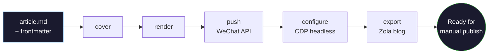

# MoonPub

[](#contributors-)


Pure Rust CLI and local publishing copilot for WeChat Official Accounts: Markdown → rendered article → WeChat draft → assisted backend configuration → blog export.

## Project Status

MoonPub is currently **Beta / early adopter ready**.

It is ready for technical users who can configure WeChat Official Account credentials and are comfortable checking generated drafts before publishing. The local Markdown → HTML preview path works without any WeChat credentials, so you can try the renderer first. Real `push` / `ship` commands call the WeChat API and may open or control Chrome for backend draft configuration.

MoonPub is **not** positioned as an unattended publishing bot. The stable core is API-first draft creation and local rendering; browser automation is an assisted mode that reduces repeated clicks in the WeChat backend while keeping final publishing under user control.

Current limits:

- Browser automation depends on the live WeChat backend UI and may soft-fail when WeChat changes DOM or wording.
- Browser automation does not bypass QR login, captcha, platform review, or final human confirmation.
- Homebrew support is planned, but no public tap is available yet.
- `write` / `expand` / `polish` / `ship --ai` are optional DeepSeek-powered commands; the core render/push pipeline does not call AI APIs.

## What It Does

Write an article in Markdown, render it locally, push it to WeChat drafts, then let MoonPub assist with repetitive backend settings:

```bash
moonpub render article.md
moonpub preview article.md
moonpub ship article.md --style literary
```

### Pipeline Flowchart



### Architecture


Core rendering is local and deterministic. Optional AI commands call DeepSeek only when you explicitly use them.

## Try Locally First

This path does not require WeChat credentials:

```bash
moonpub init
moonpub new "My First MoonPub Article"
moonpub render "Articles/drafts/My-First-MoonPub-Article.md"
moonpub preview "Articles/drafts/My-First-MoonPub-Article.md"
moonpub cover "Articles/drafts/My-First-MoonPub-Article.md" --style literary
```

Use the path printed by `moonpub new` if your title contains spaces. Start here to inspect the generated article HTML and cover card.

## Real Publish Workflow

### 1. Write

Markdown file with YAML frontmatter:

```markdown
---
title: Why I Left Everything to Paint
digest: He was 40, had a wife, kids, a good job. Then he walked away.
author: Your Name
cover: https://example.com/my-cover.png
---

:::intro
A 1-3 sentence hook to grab the reader.
:::

Your article content here...

:::summary
Closing thoughts.
:::
```

### 2. Preview

```bash
moonpub render article.md    # Generate HTML
moonpub preview article.md   # Open in browser to check
```

### 3. Configure WeChat Credentials

```bash
export WECHAT_APPID=wx***
export WECHAT_SECRET=your_secret
moonpub login
```

`moonpub login` opens Chrome once for WeChat backend login and stores the browser session for later CDP automation.

### 4. Push Or Assisted Ship

```bash
moonpub ship article.md --style literary
```

The article is pushed to WeChat drafts, then MoonPub attempts draft configuration through Chrome automation. Check the draft in WeChat and publish manually when everything looks right.

### 5. Or Step by Step

Each step runs independently:

```bash
moonpub cover article.md --style gradient --screenshot   # Just cover image
moonpub render article.md                                 # Just HTML render
moonpub push article.md                                   # Upload draft, then move bundle to ready/
moonpub configure                                         # Just draft config
moonpub export article.md                                 # Just blog export
```

## Cover Image

MoonPub handles covers in three ways, in priority order:

### 1. Frontmatter `cover` field (easiest)

Put a local image path in your article's frontmatter:

```markdown
---
title: Why I Left Everything to Paint
digest: He was 40. He walked away.
cover: ./assets/my-cover.png     # relative to article, or absolute path
---
```

During `push` or `ship`, the image is **automatically uploaded** to WeChat permanent material and set as the draft cover. URLs (`http://...`) are skipped — WeChat CDN URLs work as-is if already uploaded.

### 2. Built-in cover generator (default)

If no `cover` field is set, MoonPub generates a cover card from frontmatter fields — title, digest, and author are typeset into a styled HTML card:

```bash
moonpub cover article.md --style dark|clean|minimal|warm|serif|gradient|literary|ink|sunset|forest --screenshot
```

Default style is **literary** — a dark, book-review aesthetic with gold accents. Export to PNG with `--screenshot` (requires Chrome).

### 3. Config `thumb_media_id`

Pre-upload an image to WeChat material library manually, put the resulting `media_id` in `moonpub.toml`:

```toml
[wechat]
thumb_media_id = "EmukC2rjB9X3nj6feGSEr..."     # from WeChat material library
```

**Priority:** frontmatter `cover` > config `thumb_media_id` > auto-generated cover.

## Installation

### Option 1: Pre-built Binary (recommended, no Rust)

Download from [GitHub Releases](https://github.com/qiaopengjun5162/moonpub/releases):

```bash
# macOS Apple Silicon
curl -L https://github.com/qiaopengjun5162/moonpub/releases/download/v0.4.1/moonpub-macos-arm64.tar.gz | tar xz
sudo mv moonpub /usr/local/bin/

# macOS x86_64
curl -L https://github.com/qiaopengjun5162/moonpub/releases/download/v0.4.1/moonpub-macos-amd64.tar.gz | tar xz
sudo mv moonpub /usr/local/bin/

# Linux x86_64
curl -L https://github.com/qiaopengjun5162/moonpub/releases/download/v0.4.1/moonpub-linux-amd64.tar.gz | tar xz
sudo mv moonpub /usr/local/bin/

# Linux ARM64
curl -L https://github.com/qiaopengjun5162/moonpub/releases/download/v0.4.1/moonpub-linux-arm64.tar.gz | tar xz
sudo mv moonpub /usr/local/bin/
```

**Windows** — 从 [Releases](https://github.com/qiaopengjun5162/moonpub/releases) 下载 `moonpub-windows-amd64.zip`，解压 `moonpub.exe`，加到 PATH。

### Option 2: Cargo (requires Rust)

```bash
cargo install --git https://github.com/qiaopengjun5162/moonpub
```

### Option 3: Docker (no Rust, includes Chromium)

```bash
docker build -t moonpub https://github.com/qiaopengjun5162/moonpub.git
docker run -v ~/.config/moonpub:/root/.config/moonpub -v $(pwd):/articles moonpub status

# Convenience alias
alias moonpub='docker run -v ~/.config/moonpub:/root/.config/moonpub -v $(pwd):/articles moonpub'
```

Homebrew support is planned, but no public tap is available yet.

## Configuration

MoonPub reads credentials and settings from three sources, in priority order:
**environment variables > .env file > moonpub.toml**

### .env (recommended for API keys)

```env
WECHAT_APPID=wx***
WECHAT_SECRET=your_secret
MOONPUB_VAULT=/path/to/your/articles
```

Docker:

```bash
docker run --env-file .env -v ~/.config/moonpub:/root/.config/moonpub -v $(pwd):/articles moonpub ship article.md
```

### moonpub.toml

```bash
moonpub init
```

```toml
[articles]
root = "/path/to/your/articles"

[wechat]
appid = "wx..."
author = "Your Name"
account_type = "personal"     # personal | verified | service | wecom
auto_publish = false           # keep false for assisted/manual publish workflow
thumb_media_id = ""            # pre-uploaded cover image media_id (optional)

[footer]
enabled = true
title = "Join My Community"
description = "Welcome to all friends passionate about tech and curiosity."
rules = "· Introduce yourself with your real identity\n· Focus on tech, speak with substance\n· Respect every member, agree to disagree\n· No ads, keep it clean"
qrcode = "assets/qrcode.jpg"
qrcode_note = "Scan QR code to join.\nIf expired, reply \"join\" to get the latest."
follow_image = ""
follow_text = "Tap 👍 if you like this, tap 👆 to share with more readers."
divider = "— · —"

[blog]
kind = "zola"
root = "/path/to/blog"
```

## Browser Automation (CDP)

After `push`, WeChat drafts need manual settings: originality, tips, comments, source, preview. MoonPub assists with these repetitive steps via Chrome DevTools Protocol.

This is an assisted local workflow, not a bypass:

- You scan QR login yourself; MoonPub reuses your local browser session.
- MoonPub does not bypass captcha, review, permissions, or account restrictions.
- Final publishing remains a human decision in the WeChat backend.
- If WeChat changes the editor UI, automation steps are expected to soft-fail instead of blocking API draft creation.

First time — scan QR code once (opens browser):

```bash
moonpub login
```

Thereafter — fully headless:

```bash
moonpub configure                    # All steps
moonpub configure zanshang chuangzuo # Specific steps
moonpub configure --headed           # Debug: visible browser + screenshots
moonpub test-zanshang --headed       # Debug single step
```

Docker: login on host, configure in container.

```bash
moonpub login   # On host
docker run --env-file .env -v ~/.config/moonpub:/root/.config/moonpub -v $(pwd):/articles moonpub configure
```

## Block Templates

Use `:::blockname` in Markdown for WeChat-optimized layout:

```markdown
:::book-info
title: Book Title
author: Author
cover: https://...
publisher: Publisher
rating: 8.1
:::

:::callout
label: Key Idea
The one thing you want readers to take away.
:::

:::steps
1. Step one description
2. Step two description
3. Step three description
:::
```

12 blocks: `book-info` / `intro` / `callout` / `steps` / `summary` / `figure` / `checklist` / `cover` / `quote-card` / `divider` / `concept-card` / `emotion-card`

## De-AI (humanize)

Strips common AI writing patterns from your article:

```bash
moonpub humanize article.md
moonpub render --humanize article.md   # Combined
```

6-stage rule pipeline: filler phrases → AI vocabulary → parallelism breaking → modifier simplification → generic conclusions → em-dash cleanup

## All Commands

```
moonpub new <title>                  Scaffold a new article with frontmatter template
moonpub --version                    Print version
moonpub write <idea>                 Generate article from an idea (DeepSeek)
moonpub expand <article.md>          Expand reading notes into article (DeepSeek)
moonpub polish <article.md>          AI polish + de-AI-ify article (DeepSeek)
moonpub init                         Create moonpub.toml
moonpub status                       Article pipeline status
moonpub check <article.md>           Check bundle integrity
moonpub render <article.md>          Markdown → WeChat HTML + draft.json
  --author <name>                    Override author
  --humanize                         Strip AI patterns
moonpub preview <article.md>         Open HTML in browser
moonpub push <article.md>            Upload to WeChat drafts and move bundle to ready/
  --render                           Auto render before push
moonpub update-draft <article.md>    Update existing draft by media_id
moonpub cover <article.md>           Generate cover card
  --style dark|clean|minimal|warm|serif|gradient|literary|ink|sunset|forest
  --screenshot                       Export as PNG (needs Chrome)
moonpub humanize <article.md>        Strip AI patterns
moonpub ship <article.md>            Assisted flow: cover + render + push + configure + export
  --style dark|clean|minimal|warm|serif|gradient|literary|ink|sunset|forest
moonpub export <article.md>          Export to Zola blog
moonpub login                        Scan QR, save cookies
moonpub configure [<steps>] [--headed]  Auto-configure draft settings
moonpub test-zanshang [--headed]     Debug reward step
moonpub test-chuangzuo [--headed]    Debug creation source step
moonpub test-yulan [--headed]        Debug preview step
moonpub list-drafts                  List all WeChat drafts
moonpub delete-draft <media_id>      Delete a draft

moonpub radar add --platform <name> --keyword <kw> --title <title>
moonpub radar list [--platform <name>]
moonpub radar import <file.csv>
moonpub radar analyze <article.md> --platform <name>
moonpub radar suggest <article.md> --platform <name>
moonpub radar scrape --platform <name> --keyword <kw>
```

Global flags: `--articles <path>` / `--config <moonpub.toml>` / `--json`

## Development

```bash
cargo fmt
cargo clippy --all-targets --all-features --tests --benches -- -D warnings
cargo nextest run
```

Use `cargo nextest`, not `cargo test`.

## Architecture

- Zero AI dependencies — all transformations are deterministic
- CLI parsing: `src/cli.rs`
- Configuration: `src/config.rs`
- Article / frontmatter helpers: `src/article.rs`
- WeChat API client: `src/wechat.rs` (ureq, no SDK)
- Markdown → HTML: `src/markdown.rs`
- Block templates: `src/illustrate.rs`
- CDP automation primitives: `src/cdp.rs`
- Editor automation steps: `src/publish_steps.rs`
- Browser automation orchestration: `src/publish.rs`
- De-AI pipeline: `src/humanize.rs`
- Cover generation: `src/cover.rs`
- All styles inline CSS, WeChat-compatible

## Contributing

PR-first workflow. Branch from `main`, keep changes focused, run `cargo clippy && cargo nextest run`, push and open a PR. See [CONTRIBUTING.md](CONTRIBUTING.md).

## License

MIT

## Contributors

<!-- ALL-CONTRIBUTORS-LIST:START - Do not remove or modify this section -->
<!-- prettier-ignore-start -->
<!-- markdownlint-disable -->
<table>
  <tbody>
    <tr>
      <td align="center" valign="top" width="14.28%"><a href="https://github.com/qiaopengjun5162"><br /><sub><b>Paxon Qiao</b></sub></a><br /><a href="https://github.com/qiaopengjun5162/moonpub/commits?author=qiaopengjun5162" title="Code">💻</a> <a href="#doc-qiaopengjun5162" title="Documentation">📖</a> <a href="#ideas-qiaopengjun5162" title="Ideas">🤔</a> <a href="#projectManagement-qiaopengjun5162" title="Project Management">📆</a></td>
    </tr>
  </tbody>
</table>
<!-- markdownlint-restore -->
<!-- prettier-ignore-end -->
<!-- ALL-CONTRIBUTORS-LIST:END -->
