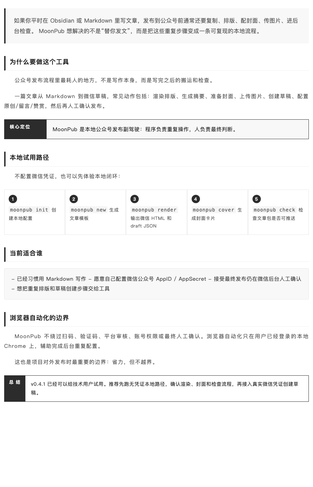

# MoonPub


纯 Rust CLI，本地公众号发布副驾驶：Markdown → 渲染文章 → 微信草稿 → 辅助配置后台 → 同步导出博客。

## 项目状态

MoonPub 当前处于 **Beta / 技术用户可试用** 阶段。

如果你能配置微信公众号 AppID / AppSecret，并愿意在发布前检查草稿，它已经可以用于真实工作流。没有微信凭证时，也可以先跑本地渲染和预览路径，确认排版、Block 模板和封面效果。

当前仓库源码版本可能高于公开 release；如果你直接从 GitHub Releases 下载，请以公开 release 页面里的版本号为准。当前已验证的公开 release 是 `v0.4.1`。

Windows 用户现在也可以先试用：PR CI 已验证源码构建的 Windows 二进制可跑通无凭证路径，release workflow 也会在发布前自动验证打包后的 zip；如果你想在自己的 Windows 机器上额外复核，再按 [docs/WINDOWS_SMOKE_CHECKLIST_ZH.md](docs/WINDOWS_SMOKE_CHECKLIST_ZH.md) 跑一次本地 smoke。

MoonPub 不是无人值守发布机器人，也不是群控工具。稳定核心是本地渲染和微信官方 API 草稿推送；浏览器自动化是辅助驾驶，用来减少微信后台里的重复点击，最终发布仍由用户自己确认。

## 你是哪类用户

如果你现在还没耐心先看完整 README，可以先按自己属于哪一类用户来选路径：

### 1. 你已经有 Markdown 文章

走这条：

- `已有 Markdown 文章 → 本地预览 → 微信草稿`

适合你，如果你已经在 Obsidian / Markdown 里写好了文章，只是想把它排版后推进到公众号草稿。

### 2. 你现在只有飞书秒记 / 语音转写素材

走这条：

- `飞书秒记 → 草稿 → 预览 → 微信草稿`

适合你，如果你现在拿到的还不是文章，而是一段原始素材，想先整理成草稿，再决定是否继续发布。

### 3. 你主要在 Obsidian 里操作，不想先打开终端

走这条：

- `Obsidian 插件入口 → 预览文章 / 发布副驾驶`

适合你，如果你想直接在 Obsidian 里调用本地 `moonpub`，少切一次终端。

### 4. 你现在主要想整理一组生活照片

走这条：

- `照片素材 → 草稿 → 预览 → 微信草稿`

适合你，如果你想先把一组照片沉淀成草稿，而不是继续散落在相册里。

这三条路径的正式说明分别在：

- [docs/RECOMMENDED_WORKFLOWS_ZH.md](docs/RECOMMENDED_WORKFLOWS_ZH.md)
- [docs/FIRST_RUN_WALKTHROUGH_ZH.md](docs/FIRST_RUN_WALKTHROUGH_ZH.md)
- [docs/PRODUCT_WRAP_ZH.md](docs/PRODUCT_WRAP_ZH.md)
- [obsidian-plugin/README.md](obsidian-plugin/README.md)

当前限制：

- `push` / `ship` 会触达微信 API，`login` / `configure` 会打开或控制 Chrome。
- 浏览器自动化依赖微信后台实时页面，微信改 DOM 或文案时，部分配置步骤可能软失败。
- 浏览器自动化不绕过扫码、验证码、平台审核、账号权限或最终人工确认。
- Homebrew tap 尚未发布，当前推荐使用 release 二进制或 Cargo 安装。
- `write` / `expand` / `polish` / `ship --ai` 是可选 AI 功能（支持配置 DeepSeek、OpenAI 等 provider）；核心渲染和推送流程不依赖 AI。

```bash
moonpub render article.md
moonpub preview article.md
moonpub ship article.md --style literary
```

## v0.4.1 演示效果

下面两张图来自 v0.4.1 release 二进制生成的本地演示素材，没有读取或触达真实微信凭证。




## 快速开始

如果你不想先看全部命令，而是想直接按推荐路径上手，先看 [docs/RECOMMENDED_WORKFLOWS_ZH.md](docs/RECOMMENDED_WORKFLOWS_ZH.md)。它把当前正式主推的三条路径拆成了：

- 已有 Markdown 文章 → 本地预览 → 微信草稿
- 飞书秒记 → 草稿 → 预览 → 微信草稿
- 照片素材 → 草稿 → 预览 → 微信草稿

如果你第一次使用，更推荐先看 [docs/FIRST_RUN_WALKTHROUGH_ZH.md](docs/FIRST_RUN_WALKTHROUGH_ZH.md)。它不是完整命令说明，而是把“先打开插件首页，再从飞书 / 照片 / 当前文章入口继续走”的最短体验路径单独拆出来了。

如果你更关心的是“这几条第一次路径到底验证到什么程度、哪些已经算通过、哪些还只是代码和文档到位”，再看 [docs/FIRST_RUN_AUDIT_ZH.md](docs/FIRST_RUN_AUDIT_ZH.md)。

如果你已经准备开始补首页、飞书、照片这几条路径的截图或录屏证据，直接看 [docs/FIRST_RUN_EVIDENCE_CHECKLIST_ZH.md](docs/FIRST_RUN_EVIDENCE_CHECKLIST_ZH.md)。仓库里也已经补了统一归档位和记录模板：`docs/first-run-evidence/README.md`、`docs/first-run-evidence/NOTES.md`，以及 3 个固定归档目录：`docs/first-run-evidence/homepage/`、`docs/first-run-evidence/feishu/`、`docs/first-run-evidence/photos/`。

如果你主要在 Obsidian 里写作，也可以看 [obsidian-plugin/README.md](obsidian-plugin/README.md)。当前插件虽然仍处于实验性阶段，但它现在已经不只是“第三个入口”，而是开始提供一个真正的首页式入口：你可以先打开 `MoonPub 首页工作台`，再从里面继续进入当前文章、飞书或照片三条上下文路径。

再回来配合下面的快速开始和命令说明看，会更容易理解。

### 不需要微信凭证：先本地体验

```bash
moonpub init                         # 创建 moonpub.toml
moonpub new "我的第一篇文章"          # 创建文章（带 frontmatter 模板）
moonpub render Articles/drafts/我的第一篇文章.md
moonpub preview Articles/drafts/我的第一篇文章.md
moonpub cover Articles/drafts/我的第一篇文章.md --style literary
```

如果标题里有空格，文件名会把空格转成 `-`；后续命令以 `moonpub new` 打印出的路径为准。

### 需要微信凭证：推送到草稿

```bash
export WECHAT_APPID=wx***
export WECHAT_SECRET=your_secret
moonpub login
moonpub push Articles/drafts/我的第一篇文章.md --render
```

或者一键发布：

```bash
moonpub ship Articles/drafts/我的第一篇文章.md --style literary
```

## 配置

```bash
moonpub init    # 创建默认 moonpub.toml
```

```toml
[articles]
root = "/path/to/ObsidianMain"

[wechat]
appid = "wx..."
author = "寻月隐君"
theme = "geek"                 # default | warm | dark | geek | paper | magazine | notebook | classic | forest | sunset | ocean | mono | editorial | zen | newsletter | academic | cyber
account_type = "personal"      # personal | verified | service | wecom
auto_publish = false            # 推荐保持 false，最终发布由人工确认
thumb_media_id = ""             # 默认封面图 media_id（ship 会自动上传刷新）
qrcode = "Context/assets/qrcode.png"

[footer]
enabled = true
variant = "community" # community | minimal
title = "加入「我的社群」"
description = "欢迎每一位对技术保持热爱与好奇心的朋友。"
rules = "· 亮出身份，以诚会友\n· 专注技术，言之有物\n· 君子之交，和而不同\n· 广告勿扰，保持纯粹"
qrcode = "Context/assets/qrcode.png"
qrcode_note = "长按下方二维码即可入群。\n若二维码过期，请在公众号后台回复 加群 获取最新二维码。"
follow_image = ""
follow_text = "点个「赞」让我知道你喜欢，点个「推荐」让更多人看到。"
divider = "— · —"

# variant = "minimal" 时只保留 follow_image / follow_text。
# qrcode 留空时也会隐藏社群标题、介绍、规则和入群提示。

[blog]
kind = "zola"
root = "/path/to/blog"

[template]
name = "寻月阁标准结尾" # 可选；供 moonpub configure moban / ship 自动插入

[ai]
provider = "deepseek"      # deepseek | openai
model = "deepseek-chat"    # 可选，默认按 provider 推荐模型
# api_key = "sk-..."       # 可选；更推荐用 DEEPSEEK_API_KEY / OPENAI_API_KEY
```

**优先级:** 环境变量 > .env 文件 > moonpub.toml

## 一键发布副驾驶 (ship)

`ship` 命令把文章推进到“微信后台可人工确认发布”的状态：

```bash
moonpub ship article.md --style literary
```

流程：封面截图 → 渲染 HTML → API 推送草稿 → 浏览器辅助配置 → 导出博客 → 人工检查并发布

支持的 style：`dark` / `clean` / `minimal` / `warm` / `serif` / `gradient` / `literary`（默认）/ `ink` / `sunset` / `forest`

首版发布前的验收清单见 [docs/RELEASE_CHECKLIST.md](docs/RELEASE_CHECKLIST.md)。如果你想先从产品层面快速理解 MoonPub 现在到底是什么、不是什么、三层结构怎么拆，先看 [docs/PRODUCT_WRAP_ZH.md](docs/PRODUCT_WRAP_ZH.md)。如果你想对外介绍项目，先看 [docs/LAUNCH_READY_ZH.md](docs/LAUNCH_READY_ZH.md) 的最终可发布状态，再看 [docs/LAUNCH_PLAN_ZH.md](docs/LAUNCH_PLAN_ZH.md) 的目标和进度条，最后从 [docs/LAUNCH_ARTICLE_ZH.md](docs/LAUNCH_ARTICLE_ZH.md) 的发布稿开始改。长期插件化、多平台、App 和商业化路线见 [ROADMAP.md](ROADMAP.md)。如果你想先看“项目现在该怎么收口目标、飞书路线该不该拆、接下来先做什么”，直接看 [docs/PRODUCT_EVALUATION_ZH.md](docs/PRODUCT_EVALUATION_ZH.md)。

## 浏览器自动化 (CDP)

API 推送后，微信草稿还需手动配置：原创声明、赞赏、留言、创作来源、预览。MoonPub 通过 Chrome DevTools Protocol 辅助完成这些重复步骤。

这是本地辅助驾驶，不是绕过平台：

- 用户自己扫码登录，MoonPub 只复用本地浏览器会话。
- 不绕过验证码、审核、权限限制或账号风控。
- 最终发布仍由用户在微信后台人工确认。
- 微信后台页面变化时，自动化步骤应软失败，不能影响 API 草稿推送主流程。

首次需扫码登录一次（打开浏览器）：

```bash
moonpub login
```

如果你不想复用 MoonPub 默认保存的浏览器登录态，而是想用一次性的隔离环境，可以显式加上 `--temporary-profile`。该模式会使用临时 Chrome profile，不读写持久 session，通常需要重新扫码。

之后完全静默 headless：

```bash
moonpub configure                    # 全部步骤
moonpub configure zanshang chuangzuo # 指定步骤
moonpub configure moban --headed     # 单独调试模板插入
moonpub configure --headed           # 调试：可见浏览器 + 截图
moonpub configure --temporary-profile --headed # 使用一次性隔离 profile 调试
moonpub step-test --temporary-profile --headed # 用隔离 profile 跑完整交互测试
```

如果你在 `moonpub.toml` 中配置了 `[template].name`，`configure` / `ship` 会在预览前自动尝试插入对应微信后台模板；未配置时该步骤会软跳过。

当前自动化状态：

| 步骤 | 状态 |
|------|------|
| 原创声明 | ✅ |
| 赞赏 | ✅ |
| 留言 | ✅ |
| 创作来源 | ✅ |
| 预览 | ✅ |
| 合集 | ⏸ 已禁用 |

## Block 模板系统

在 Markdown 中使用 `:::blockname` 语法：

```markdown
:::book-info
title: 书名
author: 作者
cover: https://...
publisher: 出版社
rating: 8.1
:::

:::intro
1-3 句话导语，迅速抓住读者
:::

:::callout
label: 核心结论
这里写你最想让读者带走的一句话
:::

:::steps
1. 第一步说明
2. 第二步说明
3. 第三步说明
:::

:::summary
结尾总结
:::

:::key-points
- 先给结论
- 再补证据
:::

:::pull-quote
source: 作者或书名

值得被放大的金句。
:::
```

支持的 14 种 Block：`book-info` / `intro` / `callout` / `steps` / `summary` / `figure` / `checklist` / `key-points` / `pull-quote` / `cover` / `quote-card` / `divider` / `concept-card` / `emotion-card`

## 正文排版主题

`moonpub render` / `moonpub ship` 会按 `[wechat].theme` 或文章 frontmatter `theme` 渲染正文。当前有 17 套正文主题：

| 主题 | 适合场景 |
|------|----------|
| `default` | 通用白底简洁 |
| `warm` | 暖色阅读、随笔 |
| `dark` | 深色强调、短文 |
| `geek` | 技术文章、代码块 |
| `paper` | 读书笔记、长文 |
| `magazine` | 观点专栏、杂志感 |
| `notebook` | 笔记整理、教程 |
| `classic` | 经典衬线、书评 |
| `forest` | 安静长文、生活思考 |
| `sunset` | 暖色观点、个人表达 |
| `ocean` | 清爽教程、知识解释 |
| `mono` | 黑白专注、短文快读 |
| `editorial` | 编辑部风格、开篇更有仪式感 |
| `zen` | 安静克制、慢读随笔 |
| `newsletter` | 周报、信息流、合集更新 |
| `academic` | 研究笔记、结构化论证 |
| `cyber` | 高对比技术文章、发布稿 |

普通 Markdown 的标题、首段导语、段落、行内高亮 / 删除线、引用、分割线、带 caption 的图片、表格、无序 / 有序 / 任务列表和三反引号代码块都会渲染成微信兼容的 inline CSS 排版。

## 去 AI 味

```bash
moonpub humanize article.md              # 单独处理
moonpub render --humanize article.md     # render 时一并处理
```

6 阶段规则处理：填充短语 → AI 词汇替换 → 排比打破 → 修饰简化 → 通用结论 → 破折号清理

## 封面生成

```bash
moonpub cover article.md                    # 默认 literary 风格
moonpub cover article.md --style dark       # 深色风格
moonpub cover article.md --style warm       # 暖色风格
moonpub cover article.md --screenshot       # 同时生成 PNG
```

`cover` 和 `ship` 共用同一套封面标题回退：frontmatter `title` → 正文第一个 `#` 标题 → 第一行有效正文 → 文件名。即使标题最终为空，也会把摘要提到主标题位置，不再渲染 `无标题` 这种占位字样。

## 飞书发布流程

对于已经进入“生成草稿”这条链路的飞书内容，推荐固定区分成两种后续模式：

- 默认保守模式：`moonpub intake feishu ... --draft --preview`
- 显式快速模式：`moonpub intake feishu ... --draft --push`

默认推荐先停在“可编辑草稿 + 本地预览”，确认内容、语气、配图都没问题后，再继续推进。只有你明确想直接推进到微信草稿时，才加 `--push`。

2026-07-01 的最新真实验证结果：

- `moonpub --articles "<Obsidian 路径>" --json intake feishu --latest --draft --preview --no-open` 已成功跑通到 `Inbox/Feishu`、`Articles/drafts` 和本地 HTML 预览输出。
- `moonpub --articles "<Obsidian 路径>" --json intake feishu --latest --draft --push` 已成功跑通到微信草稿创建、自动配置原创/赞赏/留言/创作来源，并完成微信公众号后台“预览发送到手机”。

注意两个实际使用细节：

- 当前项目入口参数是 `--articles <path>`，不是 `--vault`
- `--json` 是全局 flag，必须放在子命令前面

这里有两个“预览”阶段，不是一回事：

- 本地预览：`moonpub preview <article.md>` 或 `intake feishu ... --draft --preview`
- 微信公众号后台预览：文章已经进入微信草稿后，在 `configure` / `ship` 里执行的“预览发送到手机”

飞书内容一旦进入微信草稿，后半段就和其它文章完全一致：`configure` / `ship` -> 微信公众号后台预览 -> 人工发布。

## 全部命令

```bash
moonpub new <title>               # 创建新文章（带 frontmatter 模板）
moonpub --version                 # 显示版本号
moonpub write <idea>              # 从想法生成文章（按 [ai] 配置选择 provider）
moonpub draft-from-inbox <inbox.md> [--preview] [--no-open] [--push] # 从 Inbox 素材生成草稿；默认推荐用 --preview 先做本地预览，只有显式 --push 才继续自动推微信草稿
moonpub expand <article.md>       # 读书笔记展开成文章（按 [ai] 配置选择 provider）
moonpub polish <article.md>       # AI 润色 + 去 AI 味（按 [ai] 配置选择 provider）
moonpub intake feishu <file> [--draft] [--preview] [--no-open] [--push] # 导入飞书秒记；默认推荐先走 --preview 做本地预览，只有显式 --push 才直发到微信草稿
moonpub intake feishu --minute-token <token> [--draft] [--preview] [--no-open] [--push] # 从飞书妙记拉取逐字稿到 Inbox/Feishu
moonpub intake feishu --latest [--draft] [--preview] [--no-open] [--push] # 导入我拥有的最近一条飞书妙记
moonpub intake feishu --query <关键词> [--draft] [--preview] [--no-open] [--push] # 搜索飞书妙记并导入第一条结果
moonpub intake photos <文件或目录...> [--draft] [--preview] [--no-open] [--push] # 导入一组生活照片到 Inbox/Photos；默认推荐先走 --preview 做本地预览
moonpub init [path]               # 创建配置
moonpub status                    # 查看文章流水线 + 状态追踪
moonpub capabilities              # 查看内置发布/导出 target 能力和风险提示
  --json                          # 输出含前置条件和 argv 模板的插件 / App JSON
moonpub check <article.md>        # 检查文章三件套
moonpub render <article.md>       # Markdown → HTML + draft.json
moonpub preview <article.md> [--no-open] # 本地 HTML 浏览器预览；不是微信公众号后台预览，--no-open 只输出 HTML 路径和下一步命令
moonpub push <article.md>         # 推送到微信草稿，并移动到 ready/
  --render                        # push 前自动 render
moonpub publish <article.md>      # 通用发布 target 入口
  --target wechat-draft           # 使用内置微信公众号草稿 target
  --render                        # publish 前自动 render
moonpub update-draft <article.md> # 更新已有草稿
moonpub export <article.md>       # 导出 Zola 博客
  --target zola                   # 显式使用内置 Zola 导出 target
moonpub humanize <article.md>     # 去 AI 味
moonpub cover <article.md>        # 生成封面
  --style dark|clean|minimal|warm|serif|gradient|literary|ink|sunset|forest
  --screenshot                    # 导出 PNG
moonpub ship <article.md>         # 发布副驾驶：封面 + 渲染 + 推送 + 配置 + 导出
  --style dark|clean|minimal|warm|serif|gradient|literary|ink|sunset|forest

moonpub login                     # 扫码登录，保存 cookie
moonpub configure [<steps>] [--headed]  # 自动配置微信公众号后台草稿设置，含后台预览发送
moonpub test-zanshang [--headed]  # 调试赞赏步骤
moonpub test-chuangzuo [--headed] # 调试创作来源步骤
moonpub test-yulan [--headed]     # 调试微信公众号后台预览发送步骤
moonpub list-drafts               # 列出所有微信草稿
moonpub delete-draft <media_id>   # 删除草稿

moonpub radar add --platform <name> --keyword <kw> --title <title>
moonpub radar list [--platform <name>]
moonpub radar import <file.csv>
moonpub radar analyze <article.md> --platform <name>
moonpub radar suggest <article.md> --platform <name>
moonpub radar scrape --platform <name> --keyword <kw>
```

`push` 如果发现同一文章包旁边已有 `.media_id`，会先创建新微信草稿并更新本地 `.media_id`，成功后再按旧 `media_id` 尝试删除旧草稿。清理是 best-effort，删除失败只提示，不影响新草稿；不会按标题批量删除，避免误删同名草稿。

`capabilities --json` 会返回顶层 `schema_version` / `moonpub_version`，以及每个 target 的风险元数据、前置条件和 argv 风格 `command` 模板。插件 / App 应先检查 schema，展示缺失的 `required_env` / `required_config`，再替换 `"{article}"` 占位符后用进程参数数组调用，不要拼 shell 字符串，也不要存储真实 secret。

为了方便 Agent / 插件接管工作流，目前有 7 条链路在全局 `--json` 下会返回专用结构化对象，而不是旧的 `{"output":"..."}` 包装：

- `moonpub workspace --json`：返回 `command`、`workspace_kind`、`entry_path`、`entry_path_label`、`total_articles`、`stage_counts`、`stages`、`capabilities`、`next_command`、`next_step`；适合先判断整个工作区该走哪条入口、当前池子里有什么、下一步该先做什么
- `moonpub status --json`：返回 `command`、`stages`、`next_command`、`next_step`，每个 stage 下会带 `stage`、`count` 和 `files`；每个文件项包含 `file`、`slug`、`latest_status`、`latest_detail`
- `moonpub preview <article.md> --json`：返回 `command`、`article_path`、`html_path`、`opened_browser`、`next_command`
- `moonpub push <article.md> --json`：返回 `command`、`article_path`、`media_id`、`stage`、`next_step`
- `moonpub check <article.md> --json`：返回 `command`、`article_path`、`html_path`、`draft_json_path`、`media_id_path`、`has_markdown`、`has_html`、`has_draft_json`、`has_media_id`、`publishable`、`next_command`、`next_step`
- `moonpub draft-from-inbox <inbox.md> --json`：返回 `command`、`input_path`、`draft_path`、可选 `html_path`、`action`、`next_command`；加 `--push` 时还会带 `pushed`、`media_id`、`stage`、`next_step`
- `moonpub intake feishu ... --draft --json`：返回 `command`、`inbox_path`、`draft_path`、可选 `html_path`、`action`、`next_command`；加 `--push` 时还会带 `pushed`、`media_id`、`stage`、`next_step`
- `moonpub intake photos ... --draft --json`：返回 `command: "intake-photos"`、`inbox_path`、`draft_path`、可选 `html_path`、`action`、`next_command`；加 `--push` 时也会带 `pushed`、`media_id`、`stage`、`next_step`

全局 flag：`--articles <path>` / `--config <moonpub.toml>` / `--json`

除这 7 条工作流命令外，其它命令在 `--json` 下仍保持兼容的 `{"output":"..."}` 文本包装。

如果你现在更关心的是“插件 / App / Agent 应该优先接哪几个命令、先看全局还是先看单篇、状态层和动作层怎么分”，直接看 [docs/AGENT_PROTOCOL_ZH.md](docs/AGENT_PROTOCOL_ZH.md)。

如果你现在更关心的是“接下来到底先做什么、做到什么算当前阶段完成、按什么里程碑推进”，直接看 [docs/EXECUTION_PLAN_ZH.md](docs/EXECUTION_PLAN_ZH.md)。

如果你现在更关心的是“MoonPub 到底该被理解成一个什么产品，而不是一堆命令和零散工作流”，直接看 [docs/PRODUCT_WRAP_ZH.md](docs/PRODUCT_WRAP_ZH.md)。

如果你现在更关心的是“飞书、照片、语音这些输入源后面应该怎么统一建模”，直接看 [docs/INPUT_MODEL_ZH.md](docs/INPUT_MODEL_ZH.md)。

对飞书官方秒记链路，也就是 `--minute-token` / `--latest` / `--query` 这几种导入方式，现在重复执行时会按统一输入元数据里的 `external_id` 复用同一个 Inbox 文件；飞书当前会继续把 `minute_token` 同步写进去，兼容旧文件和来源专属追踪。后续重复生成草稿时也会复用同一个草稿路径，并通过 `action: "created" | "updated"` 明确区分是首次生成还是重跑更新。

照片链路现在也有第一版正式入口：`intake photos <文件或目录...>` 会把一组真实照片文件归档到 `Inbox/Photos/`，按统一 Inbox 元数据写入 `source: photos`、`type: photo-note`、`external_id`、`captured_at` 等字段，并生成基于真实文件信息的素材稿。后续如果加 `--draft` / `--preview` / `--push`，就继续复用和飞书一样的草稿、预览和微信草稿推进链路。

Obsidian 插件里的“查看整体文章池状态”现在也不再只是一条压缩提示，而是会继续打开一个简短工作台，把推荐入口、阶段分布、推荐下一步和风险边界分开展示，尽量把“用户拿到插件却不知道先点什么”的成本降下来。

这个工作台现在也开始更像插件首页：你可以直接从 `打开 MoonPub 首页` 进去，再继续点“检查当前文章”“预览当前文章”“导入最近飞书妙记”“导入当前图片目录”，而不需要先回命令面板重新找入口。

它现在还会根据你当前打开的是 Markdown、图片还是别的文件，给出更贴近上下文的推荐动作，尽量减少“我现在到底该点哪个入口”的犹豫。

而且首页里现在还会直接列出“第一次建议步骤”，把推荐入口继续展开成一个最短的下一步顺序。

同样地，“检查当前文章状态” 也开始走工作台式展示：会把 `check --json` 的结果拆成当前是否可发布、HTML / `draft.json` / `media_id` 是否齐全、对应路径和推荐下一步，尽量避免用户只能从一条调试味很重的状态串里自己猜。

如果你主要从飞书秒记起步，Obsidian 插件现在也开始提供两条更正式的素材入口：

- `导入最近一条飞书妙记并生成草稿预览`
- `导入最近一条飞书妙记并推进到微信草稿`

这样用户不需要先回终端，也能从插件里直接起 `intake feishu --latest` 这条主推工作流。

照片链路现在也开始有第一条正式插件入口：当你当前打开的是一张图片时，可以直接执行 `导入当前图片所在目录并生成照片草稿预览`，把这一组生活照片推进到照片草稿工作流里。

如果生成出来的草稿就在当前 vault 里，插件还会尽量自动把那篇草稿打开，减少用户导入后还要自己去找文件的操作。

飞书入口执行完成后，插件现在还会继续打开一个“飞书结果工作台”弹窗，把 Inbox、草稿、预览、是否已推进到微信草稿以及推荐下一步动作分开展示。这样这条链路不再只是弹一条提示，而更像一个真正的结果页。

这个结果页现在还支持直接继续操作：可以从里面一键打开草稿、检查草稿、预览草稿，或在本次还没 push 的情况下继续推进到微信草稿。

## 开发

```bash
cargo fmt
cargo clippy --all-targets --all-features --tests --benches -- -D warnings
cargo nextest run
```

使用 `cargo nextest`，不是 `cargo test`。

## 架构

- Zero AI dependencies — 所有转换完全离线、确定性的
- CLI 解析: `src/cli.rs`
- 配置: `src/config.rs`
- 文章 / frontmatter 工具: `src/article.rs`
- WeChat API 客户端: `src/wechat.rs` (ureq, 零 SDK)
- Markdown → HTML: `src/markdown.rs`
- Block 模板: `src/illustrate.rs`
- CDP 自动化原语: `src/cdp.rs`
- 编辑器自动化步骤: `src/publish_steps.rs`
- 浏览器自动化编排: `src/publish.rs`
- 去 AI 味: `src/humanize.rs`
- 封面生成: `src/cover.rs`
- 所有样式 inline CSS，微信兼容

## 贡献

使用 PR-first 工作流。创建 `codex/<short-topic>` 分支，保持改动聚焦，运行 `cargo clippy` 和 `cargo nextest`，推送分支，向 `main` 发起 PR。详见 [CONTRIBUTING.md](CONTRIBUTING.md)。

## 参考资料

- [docs/REFERENCES.md](docs/REFERENCES.md) — 30+ 参考项目文档
- [docs/BROWSER_AUTOMATION.md](docs/BROWSER_AUTOMATION.md) — 浏览器自动化参考

## License

MIT

## 贡献者

<!-- ALL-CONTRIBUTORS-LIST:START - Do not remove or modify this section -->
<!-- prettier-ignore-start -->
<!-- markdownlint-disable -->
<table>
  <tbody>
    <tr>
      <td align="center" valign="top" width="14.28%"><a href="https://github.com/qiaopengjun5162"><br /><sub><b>Paxon Qiao 乔鹏军</b></sub></a><br /><a href="https://github.com/qiaopengjun5162/moonpub/commits?author=qiaopengjun5162" title="Code">💻</a> <a href="#doc-qiaopengjun5162" title="Documentation">📖</a> <a href="#ideas-qiaopengjun5162" title="Ideas">🤔</a> <a href="#projectManagement-qiaopengjun5162" title="Project Management">📆</a></td>
    </tr>
  </tbody>
</table>
<!-- markdownlint-restore -->
<!-- prettier-ignore-end -->
<!-- ALL-CONTRIBUTORS-LIST:END -->
